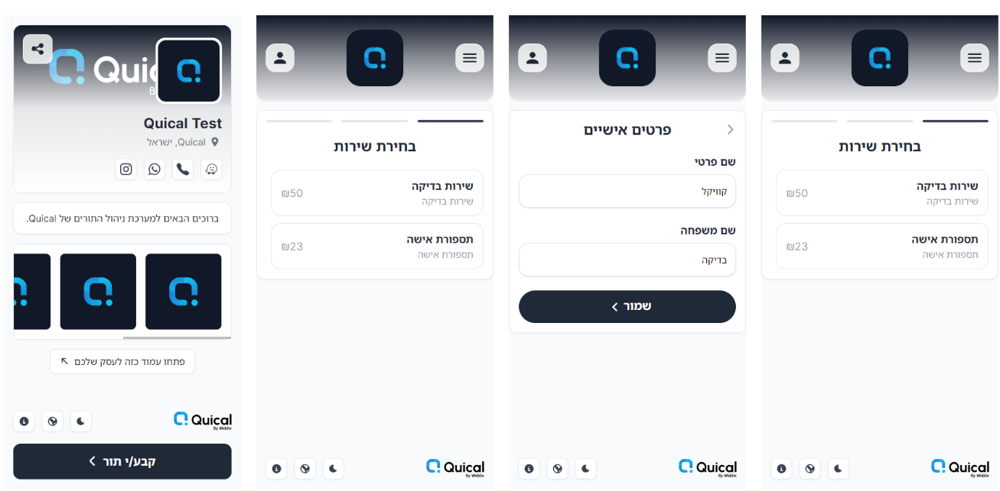
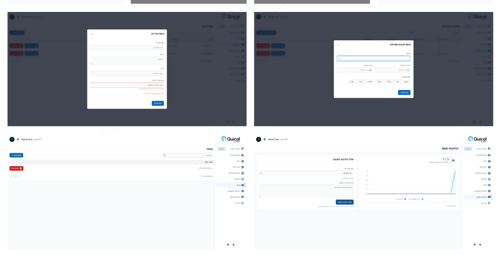
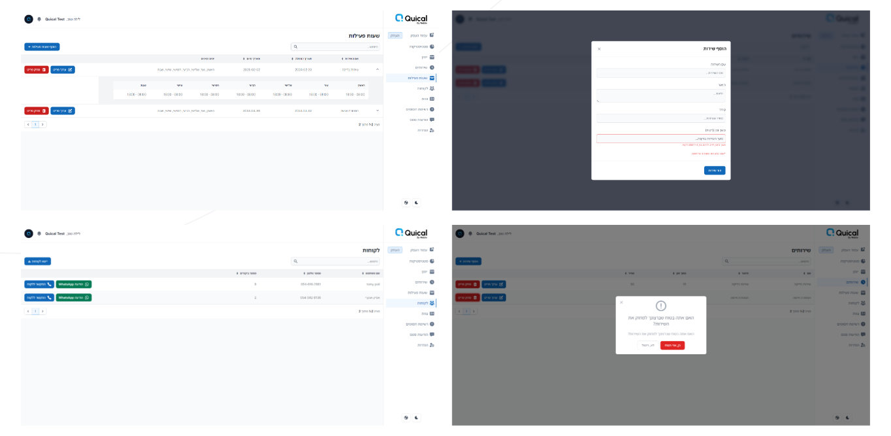
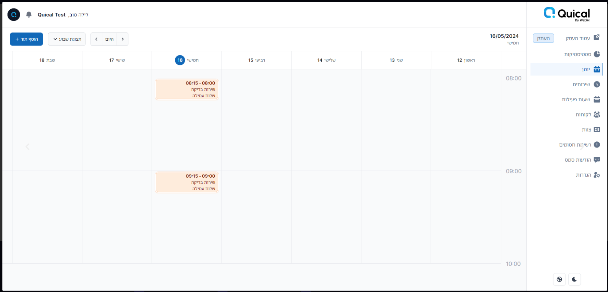
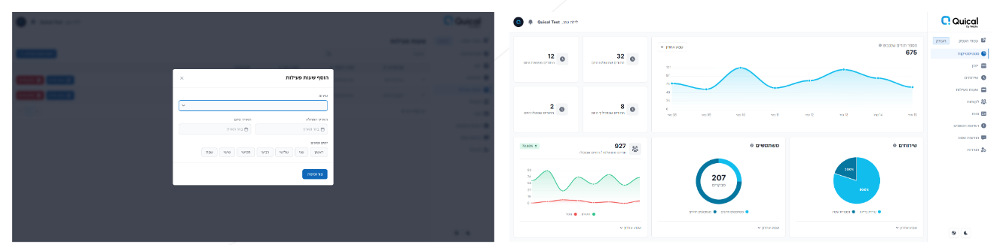

# AppointmentPro

## Overview

**AppointmentPro** is a super modern appointment scheduling system designed to streamline the booking process for businesses and their clients. It features robust authentication with OTP, a user-friendly admin panel, business-specific pages, and a sleek calendar interface. The system supports multiple notification methods, including Telegram, WhatsApp, SMS, email, and Discord, and offers webhook integration for seamless connectivity with other systems.

## Key Features

### Secure OTP Authentication
Ensure the highest level of security with one-time password (OTP) authentication.

### Admin Panel
Comprehensive admin panel for managing all aspects of the appointment system.

### Business Panel
Dedicated panel for businesses to manage their appointments and client interactions.

### Modern Calendar Interface
Intuitive and modern calendar view for easy appointment scheduling and management.

### Multi-Channel Notifications
Stay updated with notifications through Telegram, WhatsApp, SMS, email, and Discord.

### Webhook Integration
Connect with other systems using webhooks to automate workflows and enhance productivity.

## Screenshots

Here are some screenshots of the system:

## Live Demo

You can view the live demo of AppointmentPro at [quical.io](https://quical.io).

## Contact and Support

For questions, support, or business inquiries, please contact us at:
- **Email:** [poli.tomy21@gmail.com](mailto:poli.tomy21@gmail.com)
- **Phone:** +972546162881
- **Business Site:** [weblix.co.il](https://weblix.co.il)

## License

This project is licensed under the MIT License. See the [LICENSE](LICENSE) file for details.

## Contributing

We welcome contributions! Please read our [Contributing Guidelines](CONTRIBUTING.md) for more information.

---

Thank you for using AppointmentPro! We hope it enhances your scheduling experience and improves your business operations.
